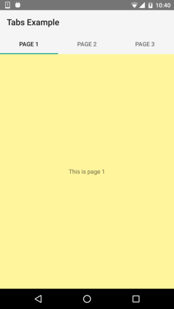
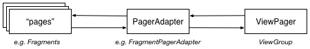

Android Tabs Example
====================

Example app showing how to implement tabs in Android.




Table of Contents
-----------------

<!-- START doctoc generated TOC please keep comment here to allow auto update -->
<!-- DON'T EDIT THIS SECTION, INSTEAD RE-RUN doctoc TO UPDATE -->


- [Usage](#usage)
- [Branches](#branches)
- [Basics](#basics)
- [Swipe Views](#swipe-views)
- [Tabs](#tabs)
  - [TabLayout Tabs](#tablayout-tabs)
  - [ActionBar Tabs](#actionbar-tabs)

<!-- END doctoc generated TOC please keep comment here to allow auto update -->


Usage
-----

1. Import project into Android Studio
2. Switch to the desired Git branch
3. Hit *Run*


Branches
--------

Each branch contains a fully working configuration:

- [01_swipe_views_and_actionbar](https://github.com/weibeld/AndroidTabsExample/tree/01_swipe_views_and_actionbar):
ActionBar as app bar, ViewPager (swipe views), no tabs
- [02_swipe_views_and_pagertitlestrip_and_actionbar](https://github.com/weibeld/AndroidTabsExample/tree/02_swipe_views_and_pagertitlestrip_and_actionbar): ActionBar as app bar, ViewPager (swipe views) with PagerTitleStrip (titles of current, previous, and next page), no tabs
- [03_actionbar_tabs_DEPRECATED](https://github.com/weibeld/AndroidTabsExample/tree/03_actionbar_tabs_DEPRECATED): ActionBar as app bar, ViewPager (swipe views), **ActionBar tabs** (combined with ViewPager)
- [04_swipe_views_and_toolbar](https://github.com/weibeld/AndroidTabsExample/tree/04_swipe_views_and_toolbar): Toolbar as app bar, ViewPager (swipe views), no tabs
- [05_swipe_views_and_pagertitlestrip_and_toolbar](https://github.com/weibeld/AndroidTabsExample/tree/05_swipe_views_and_pagertitlestrip_and_toolbar): Toolbar as app bar, ViewPager (swipe views) with PagerTitleStrip (titles of current, previous, and next page), no tabs
- [06_tablayout_tabs_fixed_and_toolbar](https://github.com/weibeld/AndroidTabsExample/tree/06_tablayout_tabs_fixed_and_toolbar): Toolbar as app bar, ViewPager (swipe views), **fixed TabLayout tabs** (combined with ViewPager)
- [07_tablayout_tabs_scrollable_and_toolbar](https://github.com/weibeld/AndroidTabsExample/tree/07_tablayout_tabs_scrollable_and_toolbar): Toolbar as app bar, ViewPager (swipe views), **scrollable TabLayout tabs** (combined with ViewPager)


Basics
------

Typically, an implementation of tabs in Android consists of:

1. Swipe views
2. Tabs UI element

These are two independent navigation patterns, but they can be combined with each other.

In general: swipe views *can (but don't need to)* be combined with tabs, and tabs *can (but don't need to)* be combined with swipe views. However, tabs benefit tremendously from being combined with swipe views, as explained below.


Swipe Views
-----------

Swipe views allow to flip through a set of "pages" by swiping horizontally on the screen.

Combined with tabs, this allows the user to switch to the next or previous tab by just swiping anywhere on the screen, rather than having to click on the tab itself. 

- Swipe views are implemented by the [ViewPager](https://developer.android.com/reference/android/support/v4/view/ViewPager.html) ViewGroup (declared in the activity's layout XML)
- A page is typically implemented as a [Fragment](https://developer.android.com/reference/android/support/v4/view/ViewPager.html)
- A [PagerAdapter](https://developer.android.com/reference/android/support/v4/view/PagerAdapter.html) supplies the ViewPager with the pages (fragments) to display. In the case of using fragments as pages, this PagerAdapter is a [FragmentPagerAdapter](https://developer.android.com/reference/android/support/v13/app/FragmentPagerAdapter.html) or [FragmentStatePagerAdapter](https://developer.android.com/reference/android/support/v13/app/FragmentStatePagerAdapter.html)

The swipe views architecture is illustrated below:



See branches [01_swipe_views_and_actionbar](https://github.com/weibeld/AndroidTabsExample/tree/01_swipe_views_and_actionbar) and [04_swipe_views_and_toolbar](https://github.com/weibeld/AndroidTabsExample/tree/04_swipe_views_and_toolbar) for code examples.

**References:**

- https://developer.android.com/training/implementing-navigation/lateral.html#horizontal-paging
- https://developer.android.com/training/design-navigation/descendant-lateral.html#paging
- https://developer.android.com/design/patterns/swipe-views.html


Tabs
----

There are currently two ways to implement a tabs UI element in Android:

1. **TabLayout tabs** using [TabLayout](https://developer.android.com/reference/android/support/design/widget/TabLayout.html) from the [*Design Support Library*](https://guides.codepath.com/android/Design-Support-Library)
2. **ActionBar tabs** using the ActionBar's [NAVIGATION_MODE_TABS](https://developer.android.com/reference/android/app/ActionBar.html#NAVIGATION_MODE_TABS) feature **(DEPRECATED)**


### TabLayout Tabs

This is the preferred approach as it's easier to implement than ActionBar tabs and does not rely on an ActionBar.

TabLayout tabs are especially easy to implement if they are used in combination with a formerly implemented ViewPager (see [Swipe Views](#swipe-views)), because then the tabs can be automatically populated by the ViewPager (i.e. no need to create and add the individual tabs manually). This is shown in the following:

1. In the activity's layout XML, add a [TabLayout](https://developer.android.com/reference/android/support/design/widget/TabLayout.html) element above the ViewPager element (and below the Toolbar element, if a Toolbar is used)
2. In the activity's onCreate method, call [setupWithViewPager(ViewPager)](https://developer.android.com/reference/android/support/design/widget/TabLayout.html#setupWithViewPager(android.support.v4.view.ViewPager)) on the TabLayout to populate and integrate the TabLayout with the ViewPager (requires that [getPageTitle](https://developer.android.com/reference/android/support/v4/view/PagerAdapter.html#getPageTitle(int)) of the PagerAdapter is overriden)

**Note:** to use TabLayout, the *Design Support Library* must be added to the project. In the module build.gradle file, do:

```
dependencies {
    compile 'com.android.support:support-v13:24.2.1'
}
```

See branches [06_tablayout_tabs_fixed_and_toolbar](https://github.com/weibeld/AndroidTabsExample/tree/06_tablayout_tabs_fixed_and_toolbar) and [07_tablayout_tabs_scrollable_and_toolbar](https://github.com/weibeld/AndroidTabsExample/tree/07_tablayout_tabs_scrollable_and_toolbar) for code examples.

**References:**

- https://developer.android.com/reference/android/support/design/widget/TabLayout.html


### ActionBar Tabs

**Note that this approach was DEPRECATED in API level 21.**

This requires the usage of the old-fashioned ActionBar as the app bar (rather than the "modern" Toolbar).

To implement ActionBar tabs, the following steps are needed in the activity's onCreate method:

1. Set ActionBar to tab mode by [setNavigationMode(ActionBar.NAVIGATION_MODE_TABS)](https://developer.android.com/reference/android/app/ActionBar.html#setNavigationMode(int))
2. Implement an [ActionBar.TabListener](https://developer.android.com/reference/android/app/ActionBar.TabListener.html)
3. Create tabs as [ActionBar.Tabs](https://developer.android.com/reference/android/app/ActionBar.Tab.html) and add them to the ActionBar

If the tabs are used in combination with swipe views (see [above](#swipe-views)), the tabs must be bidirectionally integrated with the ViewPager:

1. In [onTabSelected](https://developer.android.com/reference/android/app/ActionBar.TabListener.html#onTabSelected(android.app.ActionBar.Tab, android.app.FragmentTransaction)) of the ActionBar.TabListener, update the current page of the ViewPager ([setCurrentItem](https://developer.android.com/reference/android/support/v4/view/ViewPager.html#setCurrentItem(int)))
2. Implement a [ViewPager.SimpleOnPageChangeListener](https://developer.android.com/reference/android/support/v4/view/ViewPager.SimpleOnPageChangeListener.html), and in its [onPageSelected](https://developer.android.com/reference/android/support/v4/view/ViewPager.SimpleOnPageChangeListener.html#onPageSelected(int)) method update the current tab of the ActionBar ([setSelectedNavigationItem](https://developer.android.com/reference/android/app/ActionBar.html#setSelectedNavigationItem(int)))

This ensures that when the user clicks on a tab, the ViewPager switches to the corresponding page (1), and vice versa, when the user swipes to another page, the corresponding tab is selected in the ActionBar (2).

See branch [03_actionbar_tabs_DEPRECATED](https://github.com/weibeld/AndroidTabsExample/tree/03_actionbar_tabs_DEPRECATED) for code examples.

**References:**

- https://developer.android.com/training/implementing-navigation/lateral.html#tabs
